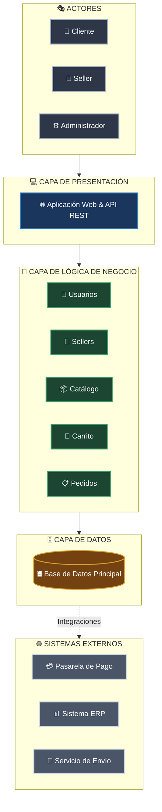

# Arquitectura Inicial del Sistema

## Diagrama de Arquitectura

## Descripción
La arquitectura inicial se organiza en tres capas principales:
* **Presentación:** permite la interacción de los usuarios con el sistema mediante la aplicación web y la API REST.
* **Lógica de negocio:** contiene los principales módulos responsables de las funcionalidades del sistema: usuarios, sellers, catálogo, carrito y pedidos.
* **Datos:** permite almacenar y consultar la información mediante una base de datos.

Además, el módulo de **Pedidos** se integra con sistemas externos como la **pasarela de pago**, el **ERP** y el **servicio de envío**.